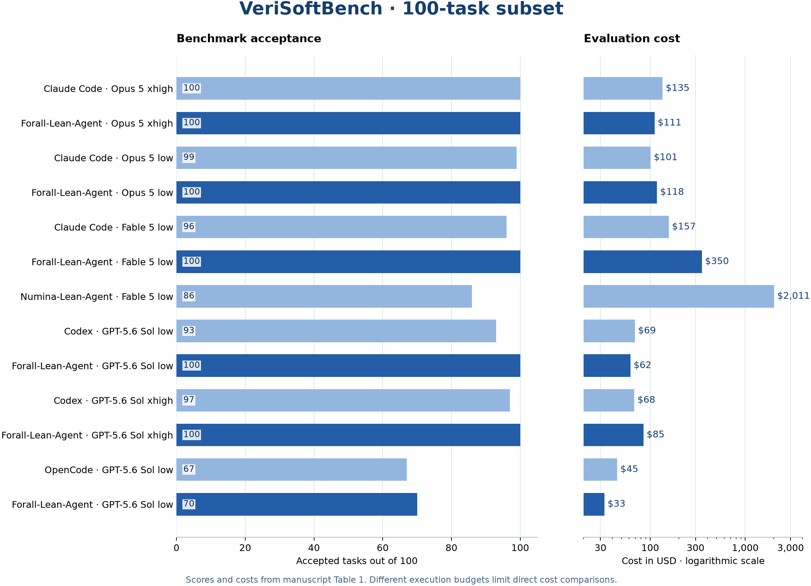

# Forall VeriSoftBench

Evaluation metadata for [Forall-Lean-Agent](https://github.com/astrio-labs/forall) on [VeriSoftBench](https://github.com/utopia-group/VeriSoftBench), released by [Astrio](https://github.com/astrio-labs).

This release covers the **100-task Aristotle subset across 11 repositories**. The full benchmark contains 500 tasks across 23 repositories. The results here do not evaluate the remaining 400 tasks.

The package contains 1,300 task records across 13 configurations, candidate artifact hashes, recorded axiom audits, independent-checker outcomes, environment pins, and scripts that reproduce the tables and figure. Solution proofs, intermediate proofs, transcripts, compiler diagnostics, and private harness code are withheld.

## Results and evidence

- [Reported results](reported_results.csv) transcribe the manuscript's model, score, cost, and token totals.
- [Task records](results.csv) contain the outcomes supported by the retained evaluation snapshots.
- [Axiom audits](axiom_audits.csv) and [independent checks](independent_checks.csv) preserve their own coverage and verdicts.
- [Generated summary](reports/summary.md) compares reported totals with retained records.
- [Subset membership](tasks.csv) and [environment pins](environment/benchmark.json) identify the evaluated tasks and dependencies.

<p align="left">
  
</p>

The figure uses the scores and costs from manuscript Table 1.

Reported totals and retained records differ in three places. The manuscript reports 100 for Forall-Lean-Agent with Opus 5 xhigh and GPT-5.6 Sol low through Codex, while the retained snapshots contain 98 and 99 accepted task records. The unaided Fable strict total is 89 in the manuscript and 85 in the retained audit. These differences remain explicit in [RECONCILIATION.md](RECONCILIATION.md). No missing success or audit verdict has been inferred.

## Reproduce the analysis

Python 3.10 or newer is sufficient for the numeric reports and validation.

```sh
git clone https://github.com/astrio-labs/forall-verisoftbench.git
cd forall-verisoftbench
python3 scripts/summarize.py
python3 scripts/validate.py
```

To regenerate the figure, use Python 3.11 or newer with the pinned plotting dependency.

```sh
python3 -m venv .venv
. .venv/bin/activate
python -m pip install -r requirements.txt
python scripts/summarize.py --plots
python scripts/validate.py
```

These commands reproduce the analysis from the public metadata. They do not run model inference or independently verify the withheld proofs.

## Interpreting the results

**Rules** is the reported benchmark acceptance count. **Strict** excludes proofs carrying forbidden kernel dependencies. **Independent** counts acceptance by the comparator, Lean export, and nanoda pipeline among candidates that pipeline judged. Unjudged candidates are outside its denominator.

Recorded budgets vary across configurations. [Evaluation settings](environment/evaluation.json) preserve the paper's target protocol separately from sample, compiler, and reviewer limits. Cost comparisons include these differences and do not isolate the effect of the agent harness under matched budgets.

The [data dictionary](DATA_DICTIONARY.md) defines missing values, hash checks, runtime scope, and audit coverage. Hash matches establish artifact identity and do not establish proof correctness. The original independent-checker records do not include candidate digests, so this package does not claim a cryptographic binding between those historical verdicts and the current artifact hashes.

## Citation and license

Related paper

*Forall-Lean-Agent for Auditable Reasoning in Formal Mathematics and Software Verification.*

Please cite [VeriSoftBench](https://arxiv.org/abs/2602.18307) when using the benchmark. This metadata and analysis release uses the [Apache License 2.0](LICENSE). Benchmark repositories and dependencies retain their original licenses. See [NOTICE](NOTICE) and [CITATION.cff](CITATION.cff).
